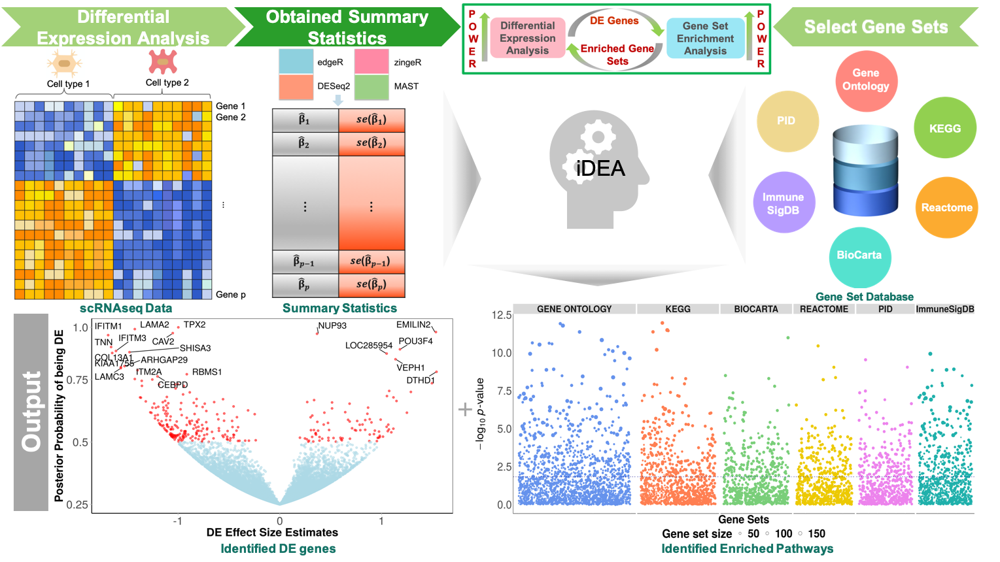

---
#
# By default, content added below the "---" mark will appear in the home page
# between the top bar and the list of recent posts.
# To change the home page layout, edit the _layouts/home.html file.
# See: https://jekyllrb.com/docs/themes/#overriding-theme-defaults
#
layout: home
---



Inputs
------------
### 1. Summary statistics from single-cell RNAseq DE approaches (i.e., zingeR, MAST, etc.), e.g.,
```
        beta	       beta_var
A1BG     -1.028331e-02 0.005304736
A1BG-AS1 -2.173872e-03 0.008438381
A2M       8.671972e-06 0.002353646
...
```
The summary statistics file is required 'data.frame' format with row names, while the header is allowed but not required.

### 2. Gene specific annotations from public databases (i.e., KEGG, Reactome, etc.), e.g.,
```
        annot1    annot2
A1BG     0      1
A1BG-AS1 1      0
A2M      0      0
...
```
The gene specific annotation file is required 'data.frame' format. The row names are required to have the same type as the row names of summary statistics file, i.e. gene symbol or transcription id etc; the header is allowed but not required. 
